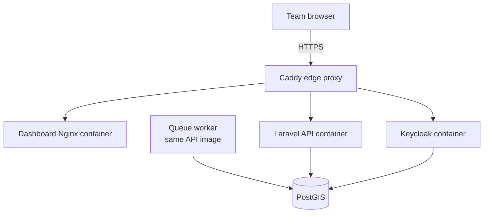
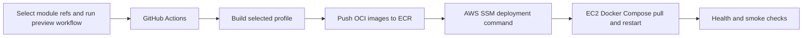

# Environments and hosting

Status: local development and internal preview are the current implementation
targets. Managed production and self-hosted production are architectural
directions, not finished deployment specifications.

This is the canonical record for GeoFarmer environment and hosting decisions.
Update it whenever a decision changes so that local convenience, preview
delivery, and future production requirements do not drift apart.

## Environment model

GeoFarmer currently distinguishes four operating contexts:

| Context | Purpose | Current delivery model | Data expectation |
| --- | --- | --- | --- |
| Local development | Fast development and debugging by one developer | Native tools with a containerized IDP, or the complete local Compose stack | Disposable |
| Internal preview | Share current work with colleagues and collect feedback | One AWS EC2 host running immutable images with Docker Compose | Disposable; resets and breaking changes are expected |
| Managed staging and production | Operate GeoFarmer as a reliable central service | Provider-agnostic Kubernetes direction | Durable, backed up, monitored, and upgraded deliberately |
| Client self-hosting | Run an entitled GeoFarmer configuration in client-controlled infrastructure | OCI images plus a supported deployment bundle | Durable and owned by the client |

An additional long-lived test environment is not needed yet. Automated tests
belong in CI, while the internal preview provides human integration testing.
A production-like staging environment should be introduced when production
operations begin, not by renaming the intentionally unstable preview.

## Principles shared by every environment

- Source repositories are inputs to builds, not runtime dependencies.
- CI builds immutable, versioned artifacts. Deployments pull artifacts and do
  not download executable module code at startup.
- The API and its enabled in-process modules run in one API image. Queue
  workers and future schedulers use the same image with different commands.
- The IDP has its own image. The dashboard may be shipped as static files in a
  small web-server image. Mobile applications are signed platform artifacts.
- Module build profiles determine which code is present. Entitlements and
  deployment configuration determine which available modules may be enabled.
- Secrets and environment-specific URLs are supplied at deployment time and
  never baked into images or committed configuration.
- Container and application behavior should not depend on one cloud provider.
- Server OCI images are published for both `linux/amd64` and `linux/arm64`
  under one multi-platform image reference. Docker selects and downloads only
  the variant matching the host.

See [Modules, build profiles, and delivery](./architecture-modules-and-delivery.md)
for the artifact and module model.

## Local development

The preferred local workflow optimizes for short feedback cycles:

- Laravel API through Laravel Herd;
- local PostgreSQL;
- dashboard through `npm start`;
- Laravel database queue listener through the VS Code launch configuration;
- Keycloak through `geofarmer-core/apps/idp/docker-compose.yml`.

Core and module repositories are sibling directories. Composer, npm, and
Flutter packages may be linked from those local paths, so a module change does
not require publishing an intermediate package or image.

The complete deployment Compose stack may also run locally when image-level
parity is more important than rapid development. The native and full Compose
workflows should remain independently usable. They share default ports, so
only one IDP/stack should run at a time.

The deployment repository keeps self-contained Compose definitions under
`targets/local` and `targets/aws-preview`. They intentionally do not inherit
from one another: local builds source directly and uses a private local `.env`,
while AWS preview pulls immutable images and combines committed target settings
with runtime secrets retrieved by the instance.

## Internal preview

The preview is an internal review environment, not staging. It may deploy
frequently, contain breaking changes, and have its databases reset without a
data-migration promise.

The initial topology is intentionally small:

The implementation uses:

- one AWS EC2 instance with an Elastic IP;
- Docker Compose from the `geofarmer-deployment` repository;
- Caddy for public TLS termination and hostname routing;
- the dashboard image's Nginx only for serving its internal static files;
- one PostGIS server containing separate `geofarmer` and `keycloak` databases;
- named volumes on the instance for database, API storage, and Caddy state;
- a dedicated queue-worker container using the same API image;
- no Kubernetes and no managed database.

The public endpoints are:

| Component | URL |
| --- | --- |
| Dashboard | `https://preview.geofarmer.org` |
| API | `https://api.preview.geofarmer.org` |
| Identity provider | `https://auth.preview.geofarmer.org` |

All three DNS records point to the same Elastic IP. Caddy is the only service
published on the EC2 network interface; direct application ports bind to host
loopback for diagnostics.

"Internal" currently describes the intended audience, not a private network.
Public certificate validation requires the edge to be reachable.
Self-registration remains enabled and must use the verified GeoFarmer
registration flow with appropriate throttling and abuse protection. A VPN or
dedicated access gateway can be added later if the preview must become
network-private.

### Preview delivery flow

The intended CI/CD flow is:

GitHub Actions should authenticate to AWS using OpenID Connect rather than
long-lived AWS access keys. Images should be tagged for readability but
deployed by immutable digest or commit SHA. Running containers receive
registry access only; they do not receive GitHub source credentials.

The first implementation uses these concrete boundaries:

- a trusted maintainer manually starts the workflow in the private
  `geofarmer-deployment` repository and selects the Core and Forum refs;
- a read-only GitHub App installation token checks out the selected private
  Core and Forum revisions on the ephemeral GitHub runner;
- four private ECR repositories hold the API, IDP, dashboard, and database
  images;
- every deployment uses a unique deployment-commit/workflow-run image tag
  rather than a mutable `latest` tag;
- the small compressed Compose bundle and image references are sent inline in
  SSM Run Command, with a size guard below SSM's document limit;
- the instance receives no GitHub credential and pulls the matching native
  image variants from ECR using its instance role; and
- the instance role, not GitHub Actions, reads the preview runtime credentials
  from one narrowly scoped AWS Secrets Manager secret.

Each deployment retrieves the current runtime-secret version directly on the
host and materializes a root-readable Compose environment file atomically.
Secret values do not pass through GitHub. Secrets Manager is the preview
adapter; future Kubernetes and self-hosted deployments may use a different
secret backend without changing application images.

### Initial preview sizing

Start the preview on an ARM64 `t4g.medium`:

- 2 vCPUs and 4 GiB RAM;
- 100 GiB encrypted `gp3` EBS storage;
- a small swap file as an emergency buffer, not as normal working memory;
- CloudWatch Agent metrics and alarms for memory and disk, plus EC2 CPU credit
  and container-restart monitoring.

This is a reasonable lower-cost starting point for occasional internal use,
provided CI builds the images and the EC2 host only pulls and runs them. Image
builds, especially the dashboard and IDP build stages, should not run on this
host. If memory remains near 80%, swapping becomes sustained, or containers
are killed for lack of memory, move to an 8 GiB `t4g.large` rather than tuning
around the shortage.

GeoFarmer supports ARM64 for efficient managed hosting without becoming
ARM-only. CI publishes one multi-platform image reference containing separate
AMD64 and ARM64 variants. A host pulls only its matching variant, so supporting
both architectures increases registry storage and build work but does not
increase the image downloaded to or stored on each server.

The deployment uses a thin GeoFarmer database image based on the official
multi-platform PostgreSQL image and PostgreSQL's ARM64-capable PostGIS packages
instead of the AMD64-only `postgis/postgis` image. The dashboard Dockerfile
selects its native build packages from the target architecture. The remaining
selected API, IDP, dashboard runtime, and Caddy bases publish ARM64 and AMD64
variants. Both platform builds must still pass CI before release.

The 100 GiB volume is ample for the initial disposable data and several image
revisions, but deployment automation should still rotate container logs and
remove superseded unreferenced images without deleting active volumes.

## Managed staging and production

The central production direction is provider-agnostic Kubernetes using the
same OCI artifacts proven in preview. Kubernetes is an operational boundary,
not a reason to split every application module into a network service.

Before this context is implemented, it needs explicit decisions for:

- Kubernetes packaging and ingress;
- staging-to-production artifact promotion;
- managed or externally operated PostgreSQL and PostGIS;
- database isolation, migrations, backups, and restore testing;
- object/file storage;
- secret management and key rotation;
- horizontal scaling and queue-worker sizing;
- observability, alerting, audit retention, and incident handling;
- availability targets, maintenance windows, and rollback procedures.

Staging should resemble production topology and promote the same already-built
image digests. It should not rebuild source into different artifacts.

## Client self-hosting

Self-hosters should consume release artifacts rather than clone private source
repositories. The expected delivery contract is:

- entitled OCI images from a registry using client-specific read-only
  credentials;
- a versioned deployment bundle and environment template;
- explicit upgrade and backup instructions;
- a build profile that excludes proprietary modules the client must not
  receive;
- runtime activation limited to modules present in and entitled for that
  artifact.

A single-host Docker Compose bundle is the likely first supported option for
smaller installations. A Helm/Kubernetes bundle may be offered where clients
need high availability or already operate Kubernetes. These are possible
support tiers, not finalized promises.

The same image tag works on common AMD64 client servers and ARM64 servers;
Docker selects the compatible variant. Self-hosters therefore do not need
architecture-specific GeoFarmer release names or local image builds.

Self-hosting still needs decisions for offline or restricted-network installs,
registry-token lifecycle, license validation and grace periods, supported
infrastructure versions, backups, upgrades, telemetry, and the boundary
between client and GeoFarmer operational responsibility.

## Mobile applications

Flutter applications do not run in Compose or Kubernetes. They are built as
signed Android/iOS artifacts and connect to the selected environment's public
API and IDP. A module build profile must select compatible API, dashboard, and
Flutter packages from the same release set.

Development builds may target local or preview endpoints. Staging and
production require separate application flavors, signing, store distribution,
and environment configuration; the exact mechanism remains open.

## Current decision boundary

Accepted now:

- native local development remains supported;
- the internal AWS preview uses one EC2 host and Docker Compose;
- preview uses real `geofarmer.org` subdomains, an Elastic IP, and Caddy HTTPS;
- CI produces images; runtime never assembles modules from source;
- server images support AMD64 and ARM64 through multi-platform OCI manifests;
- the internal preview runs the ARM64 variant on AWS Graviton;
- managed production is Kubernetes-oriented but deferred;
- self-hosting consumes entitled release artifacts rather than GitHub source.

Still open:

- promotion and rollback conventions beyond the disposable preview;
- whether preview needs a network-private access layer;
- production Kubernetes, database, storage, and operations design;
- supported self-hosting tiers and licensing behavior;
- mobile build flavors and distribution.
