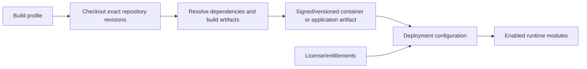

# Modules, build profiles, and delivery

Status: accepted foundation; installation and licensing workflows remain to be implemented.

## Decision summary

GeoFarmer module composition happens while artifacts are built. Running
containers never download application modules or resolve package dependencies.



The module lifecycle uses four separate states:

| State | Meaning | Source of truth |
| --- | --- | --- |
| Available | Module code is present in the image or development workspace | Build artifact and module registry |
| Entitled | The installation is permitted to use the module | Future licensing/entitlement layer |
| Enabled | The deployment requests the module | Deployment configuration |
| Installed | Database initialization for the module has completed | Future database installation state |

Availability never implies enablement or installation. Core is always enabled.

## Artifact boundaries

| System | Deliverable |
| --- | --- |
| API | One OCI image containing Core and the modules selected by its build profile |
| Queue workers and scheduler | The same API image with a different process command |
| Identity provider | A separate OCI image derived from a pinned Keycloak release |
| Dashboard | Static files; optionally wrapped in a small web-server image for Docker Compose and self-hosting |
| Preview database | A thin PostgreSQL and PostGIS OCI image for AMD64 and ARM64 |
| Mobile applications | Signed Android/iOS application artifacts, not container images |

An API module is an in-process package, not an independently deployed service.
A module should become a separate service only when it requires an actual
operational boundary such as independent scaling, isolation, or data ownership.

## Build profiles

Build profiles define the upper bound of modules available to a deployment.
The initial profile families are:

| Profile | Purpose |
| --- | --- |
| `free` | Core and open-source modules; suitable for public distribution |
| `commercial` | The normal commercial module set; distributed through a restricted registry |
| `internal-preview` | Current development revisions for internal review; may be reset or break frequently |
| `partner-*` | Exceptional configurations for a small number of strategic partners |

Profiles should be data, not long-lived source branches. A profile records the
selected repositories and immutable commit or release references. The same
profile should drive the API, dashboard, and Flutter builds so that packages
from one module use compatible revisions.

The commercial image may contain modules that are disabled for a particular
deployment. Anyone who can pull an image can inspect the code it contains,
however. If a customer must not receive a module's source, that module must be
excluded by the build profile rather than merely disabled by licensing.

## Source acquisition

Source acquisition is a build concern and differs by environment:

| Environment | Source mechanism | Credentials |
| --- | --- | --- |
| Local development | Sibling repository paths and linked packages | Developer Git credentials |
| GitHub Actions | Multiple repositories checked out at exact revisions | Short-lived GitHub App token or equivalent secret |
| Hosted deployment | Pull a previously built image | Registry credentials/runtime identity |
| Self-hosted deployment | Pull an entitled image from a registry | Customer-specific read-only registry token |

GitHub tokens must not be committed, copied into image layers, or supplied to
running application containers. CI acquires source and produces an immutable
artifact. Runtime environments consume that artifact without GitHub access.

## Image and release rules

- Build dependencies for Core and all selected modules together.
- Record the Core and module revisions in a manifest inside every artifact.
- Publish server images for `linux/amd64` and `linux/arm64` under one
  multi-platform image reference.
- Tag releases meaningfully, but deploy by the immutable multi-platform index
  digest so each host selects its matching platform variant.
- Build once and promote the same digest through test, staging, and production.
- Run database upgrades as an explicit deployment job, not concurrently in
  every API replica.
- Never install or update executable module code during container startup.
- Never automatically remove module data when a module is disabled or absent.

## API discovery and boot

Laravel package discovery makes a module definition available to Core. Every
module provider registers that definition regardless of whether the module is
enabled. Optional providers then skip routes, policies, migrations, and other
runtime integration unless deployment configuration enables their module key.

For the current development setup, optional modules are selected with:

```dotenv
GEOFARMER_MODULES=forum,smart-functions,survey-forms
```

Core is implicit and does not need to appear in the value. An empty value boots
Core only. Configuration that names a module missing from the current build is
an error rather than a silent fallback.

Inspect a running build with:

```bash
php artisan geofarmer:modules
php artisan geofarmer:modules --json
```

The upgrade command migrates and seeds enabled modules only. A future dedicated
installation workflow will reconcile enabled, entitled, and database-installed
states. Merely adding a package to an image must never silently install it.

## Configuration-cache constraint

Laravel configuration and route caches contain the module selection effective
when those caches are generated. Until runtime licensing and route middleware
are designed, deployments that select modules at container runtime must rebuild
those caches after configuration is present or leave them uncached. A cached
commercial image must not assume that every code-available module is entitled.
