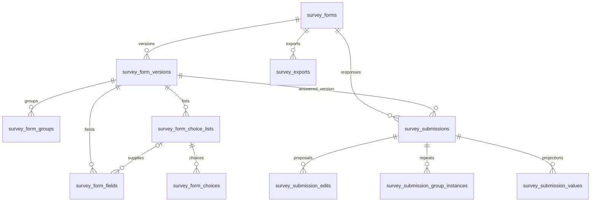

# Surveys architecture

Surveys is an optional, in-process GeoFarmer module. It provides a Laravel API
package and an Angular dashboard package; mobile collection is planned. This page
describes the implementation as of 2026-09-21, not a claim of complete ODK parity.
For user workflows, see [creating surveys](./usage-surveys-authoring.md) and
[reviewing results](./usage-surveys-results.md).

## Package and authorization boundaries

| Boundary | Implementation |
| --- | --- |
| Composer package / namespace | `geofarmer/surveys` / `GeoFarmer\Surveys` |
| Angular package | `@geofarmer/surveys` |
| Module key | `surveys` |
| Channel routes | `/api/channels/{channel}/surveys` |
| Definition permissions | `surveys.forms.view`, `surveys.forms.manage` |
| Response permissions | `surveys.submissions.submit`, `surveys.submissions.manage` |

Core resolves effective module activation and channel permissions. Availability
of a questionnaire does not grant access to its answers. Definition management
belongs to the owning channel; response management is checked in the participation
channel. Selecting a descendant channel in results requires authorization there.

`participation_scope` is `current`, `children` or `all`. Children includes every
nested depth. The owner keeps management access even with children-only collection.
Public sharing (`is_public`) permits cloning published definitions across channels
in the same portal, independently of the channel hierarchy. It does not share
responses or unpublished drafts. Cloning creates independent IDs and file copies,
starts private, and has no ongoing synchronization with the source.

## Data model

Definitions are version-owned snapshots. Publishing freezes the answered
version; later drafts do not rewrite historical questionnaires. A form's channel
slug and its XLSForm `form_id` are separate identifiers. Groups and questions use
ODK names and paths within their version; results are selected by version.

`survey_submissions.data` holds canonical nested answers, including repeat arrays.
`attachments` maps answer filenames to immutable Core file references and file
metadata. The participation channel and published version are stored on every
response. Typed values and repeat-instance rows are disposable projections used
for reporting, not the source of truth. Projection jobs work under submission
locks; replacing answers removes old derived rows before rebuilding them.

Survey definition assets use Core file storage and version asset references.
XLSForm export preserves filenames but does not bundle file contents.

## Submission lifecycle and review

| Status | Meaning | Included in aggregates |
| --- | --- | --- |
| `in_progress` | Collector draft | No |
| `submitted` | Received; review is optional | Yes, after projection |
| `accepted` | Explicitly accepted by a reviewer | Yes, after projection |
| `rejected` | Retained but excluded | No |

Client-generated submission IDs make upload retries idempotent. Reusing an ID
returns the existing response rather than applying changed answers. Unauthorized
requests and malformed request structures are rejected; suspected duplicates and
quota conflicts are saved for review.

Only the original collector may propose answer edits. Edits carry an ID and base
revision. Stale revisions, expired editing windows and edits of rejected responses
are retained as pending proposals. The backend supports reviewing these proposals;
the dashboard interface for that workflow is still missing.

Moderators can accept, reject with a reason, or return a submitted response to
`submitted`. Review checks the current revision and never alters the answer data.
`rejection_reason` is the active reason. `review_history` is JSON on the submission,
recording status transitions, actor, time, reason, revision and flag snapshots.
There is no separate review-history table. History is exposed through a paginated
endpoint and omitted from ordinary submission serialization. Applying a collector
edit resets review status and records the transition when the status changes.

## Automatic flags

`review_flags` is an array of server-generated objects with a `code` and supporting
details. Flags are advisory: they neither block receipt nor remove answers from
results. Accepting or rejecting snapshots active flags into history and clears
the attention list. Applied edits recalculate target-related flags.

| Code | Rule |
| --- | --- |
| `submission_limit_exceeded` | Active responses exceed the configured per-target limit; includes the limit. |
| `possible_duplicate` | Different submission ID, same target and version, nonempty identical JSON answers; includes a matching submission ID. |
| `future_submission_time` | Device timestamp is more than five minutes ahead; retains the reported time. |

Targets are places, mapped areas, channel-scoped respondent references or anonymous
interviews. A collector is never used as a respondent identity. Limits count
submitted and accepted responses across versions. Rejected responses and drafts
do not consume quota. Unlimited and anonymous collection have no quota flags.

For duplicate checks, JSON object-key order is ignored; array order and scalar
types remain significant. When multiple submissions are allowed, including
unlimited collection, timestamps must also be within five minutes. Collection
time is compared, not offline batch arrival time. Anonymous interviews are not
compared. One-response-per-target surveys can match identical earlier responses
outside that window. This detects possible duplicates, not identity or fraud.

A per-target PostgreSQL advisory lock serializes competing uploads inside their
transactions. Checks use scoped submission queries and existing indexes rather
than a global answer scan. Future timestamps are clamped to server time on receipt;
small clock differences do not generate a flag.

## Results and export boundaries

Aggregates and question-answer previews use processed submitted/accepted responses.
Individual responses can be filtered to other statuses. A complete export reads
canonical answer JSON across versions and authorized participation channels,
independently of page filters and projection status. Rejected responses remain in
CSV output, with their status and active rejection reason.

See [operations](./architecture-surveys-operations.md) for queue/storage behavior,
and [compatibility](./architecture-surveys-compatibility.md) for supported behavior
and remaining work.
